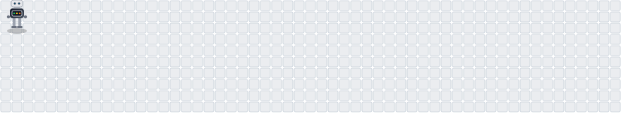

<!-- Header -->

  

  <b>Robotics Research Intern at BMW Group (RoboTac Lab) · MSc Robotics, Systems and Control at ETH Zürich</b>

  Robot Learning · Embodied AI · Grasp & Manipulation · Robot Perception

---

  

---

 
<picture>
  <source media="(prefers-color-scheme: dark)" srcset="images/github-contribution-grid-robot-dark.svg" />
  <source media="(prefers-color-scheme: light)" srcset="images/github-contribution-grid-robot.svg" />
  
</picture>
